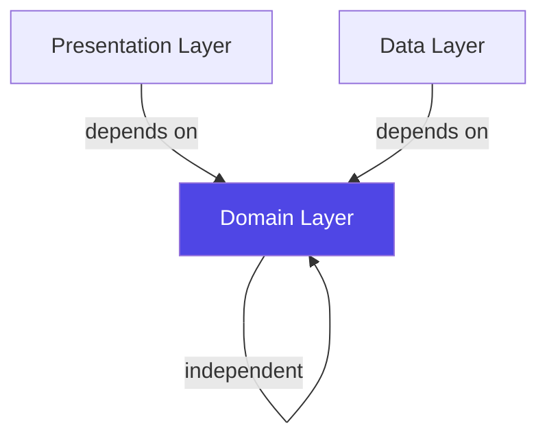

## Clean Architecture Principles

The Flutter Billing App implements **Clean Architecture** with strict layer separation and dependency rules. This ensures that business logic remains independent of frameworks, UI, and databases.

<Frame>
  
</Frame>

## The Three Layers

<CardGroup cols={3}>
  <Card title="Domain Layer" icon="brain" color="#4F46E5">
    Pure business logic - entities, repository contracts, and use cases
  </Card>
  <Card title="Data Layer" icon="database" color="#10B981">
    Data sources, models, and repository implementations
  </Card>
  <Card title="Presentation Layer" icon="window" color="#F59E0B">
    UI components, BLoC state management, and pages
  </Card>
</CardGroup>

## Dependency Rules

The fundamental rule: **dependencies point inward**. Outer layers can depend on inner layers, but never the reverse.



<Warning>
**Critical Rule**: The domain layer NEVER imports from presentation or data layers. It defines contracts (interfaces) that outer layers implement.
</Warning>

## Domain Layer

The **domain layer** is the heart of the application, containing pure business logic with zero dependencies on Flutter or external packages (except utilities like `equatable` and `fpdart`).

### Entities

Entities are immutable business objects that represent core concepts:

<CodeGroup>
```dart lib/features/product/domain/entities/product.dart
import 'package:equatable/equatable.dart';

class Product extends Equatable {
  final String id;
  final String name;
  final String barcode;
  final double price;
  final int stock;

  const Product({
    required this.id,
    required this.name,
    required this.barcode,
    required this.price,
    this.stock = 0,
  });

  @override
  List<Object?> get props => [id, name, barcode, price, stock];
}
```

```dart lib/features/billing/domain/entities/cart_item.dart
import 'package:equatable/equatable.dart';
import 'package:billing_app/features/product/domain/entities/product.dart';

class CartItem extends Equatable {
  final Product product;
  final int quantity;

  const CartItem({
    required this.product,
    this.quantity = 1,
  });

  // Business logic: calculate total price
  double get total => product.price * quantity;

  CartItem copyWith({
    Product? product,
    int? quantity,
  }) {
    return CartItem(
      product: product ?? this.product,
      quantity: quantity ?? this.quantity,
    );
  }

  @override
  List<Object> get props => [product, quantity];
}
```
</CodeGroup>

<Info>
Entities use `Equatable` for value equality comparison, essential for BLoC state management to detect changes.
</Info>

### Repository Contracts

Repositories are defined as **abstract interfaces** in the domain layer:

```dart lib/features/product/domain/repositories/product_repository.dart
import 'package:fpdart/fpdart.dart';
import '../../../../core/error/failure.dart';
import '../entities/product.dart';

abstract class ProductRepository {
  Future<Either<Failure, List<Product>>> getProducts();
  Future<Either<Failure, Product>> getProductByBarcode(String barcode);
  Future<Either<Failure, void>> addProduct(Product product);
  Future<Either<Failure, void>> updateProduct(Product product);
  Future<Either<Failure, void>> deleteProduct(String id);
}
```

<Accordion title="Why Either<Failure, Result>?">
The `Either` type from `fpdart` represents operations that can succeed or fail:
- **Left side**: `Failure` (error case)
- **Right side**: Success value

This eliminates try-catch blocks and makes error handling explicit and type-safe.
</Accordion>

### Use Cases

Each use case encapsulates a **single business operation**. All use cases implement the base `UseCase` contract:

```dart lib/core/usecase/usecase.dart
import 'package:fpdart/fpdart.dart';
import '../error/failure.dart';

abstract class UseCase<Result, Params> {
  Future<Either<Failure, Result>> call(Params params);
}

class NoParams {}
```

**Example Use Cases**:

<CodeGroup>
```dart lib/features/product/domain/usecases/product_usecases.dart
import 'package:fpdart/fpdart.dart';
import '../../../../core/error/failure.dart';
import '../../../../core/usecase/usecase.dart';
import '../entities/product.dart';
import '../repositories/product_repository.dart';

class GetProductsUseCase implements UseCase<List<Product>, NoParams> {
  final ProductRepository repository;

  GetProductsUseCase(this.repository);

  @override
  Future<Either<Failure, List<Product>>> call(NoParams params) {
    return repository.getProducts();
  }
}

class AddProductUseCase implements UseCase<void, Product> {
  final ProductRepository repository;

  AddProductUseCase(this.repository);

  @override
  Future<Either<Failure, void>> call(Product params) {
    return repository.addProduct(params);
  }
}

class GetProductByBarcodeUseCase implements UseCase<Product, String> {
  final ProductRepository repository;

  GetProductByBarcodeUseCase(this.repository);

  @override
  Future<Either<Failure, Product>> call(String params) {
    return repository.getProductByBarcode(params);
  }
}
```
</CodeGroup>

<Note>
**Single Responsibility**: Each use case has one clear purpose. This makes testing trivial and keeps business logic modular.
</Note>

## Data Layer

The **data layer** implements repository contracts and manages data persistence.

### Data Models

Models extend entities and add serialization capabilities:

```dart lib/features/product/data/models/product_model.dart
import 'package:hive/hive.dart';
import '../../domain/entities/product.dart';

part 'product_model.g.dart'; // Hive code generation

@HiveType(typeId: 0)
class ProductModel extends Product {
  @override
  @HiveField(0)
  final String id;
  @override
  @HiveField(1)
  final String name;
  @override
  @HiveField(2)
  final String barcode;
  @override
  @HiveField(3)
  final double price;
  @override
  @HiveField(4)
  final int stock;

  const ProductModel({
    required this.id,
    required this.name,
    required this.barcode,
    required this.price,
    required this.stock,
  }) : super(
          id: id,
          name: name,
          barcode: barcode,
          price: price,
          stock: stock,
        );

  // Convert domain entity to data model
  factory ProductModel.fromEntity(Product product) {
    return ProductModel(
      id: product.id,
      name: product.name,
      barcode: product.barcode,
      price: product.price,
      stock: product.stock,
    );
  }

  // Convert data model to domain entity
  Product toEntity() {
    return Product(
      id: id,
      name: name,
      barcode: barcode,
      price: price,
      stock: stock,
    );
  }
}
```

<Info>
**Pattern**: Models **extend** entities, inheriting business logic while adding persistence annotations. This keeps domain entities clean.
</Info>

### Repository Implementation

Repositories implement the domain contracts and handle data operations:

```dart lib/features/product/data/repositories/product_repository_impl.dart
import 'package:fpdart/fpdart.dart';
import '../../../../core/data/hive_database.dart';
import '../../../../core/error/failure.dart';
import '../../domain/entities/product.dart';
import '../../domain/repositories/product_repository.dart';
import '../models/product_model.dart';

class ProductRepositoryImpl implements ProductRepository {
  @override
  Future<Either<Failure, List<Product>>> getProducts() async {
    try {
      final box = HiveDatabase.productBox;
      final products = box.values.toList();
      return Right(products);
    } catch (e) {
      return Left(CacheFailure(e.toString()));
    }
  }

  @override
  Future<Either<Failure, Product>> getProductByBarcode(String barcode) async {
    try {
      final box = HiveDatabase.productBox;
      final product = box.values.firstWhere(
        (element) => element.barcode == barcode,
        orElse: () => throw Exception('Product not found'),
      );
      return Right(product);
    } catch (e) {
      return Left(CacheFailure(e.toString()));
    }
  }

  @override
  Future<Either<Failure, void>> addProduct(Product product) async {
    try {
      final box = HiveDatabase.productBox;
      final model = ProductModel.fromEntity(product);
      await box.put(model.id, model); // Using ID as key
      return const Right(null);
    } catch (e) {
      return Left(CacheFailure(e.toString()));
    }
  }

  @override
  Future<Either<Failure, void>> updateProduct(Product product) async {
    try {
      final box = HiveDatabase.productBox;
      final model = ProductModel.fromEntity(product);
      await box.put(model.id, model);
      return const Right(null);
    } catch (e) {
      return Left(CacheFailure(e.toString()));
    }
  }

  @override
  Future<Either<Failure, void>> deleteProduct(String id) async {
    try {
      final box = HiveDatabase.productBox;
      await box.delete(id);
      return const Right(null);
    } catch (e) {
      return Left(CacheFailure(e.toString()));
    }
  }
}
```

<Check>
**Error Handling**: All exceptions are caught and converted to `Left(Failure)`. Success returns `Right(result)`. No exceptions leak to presentation layer.
</Check>

## Presentation Layer

The **presentation layer** contains UI and state management. See [State Management](/architecture/state-management) for details on BLoC implementation.

Key characteristics:
- Depends only on domain layer
- Uses BLoC for state management
- Emits events, receives states
- Never contains business logic

## Dependency Injection

All dependencies are registered in the service locator:

```dart lib/core/service_locator.dart
import 'package:get_it/get_it.dart';

final sl = GetIt.instance;

Future<void> init() async {
  // BLoCs (Factory - new instance each time)
  sl.registerFactory(
    () => ProductBloc(
      getProductsUseCase: sl(),
      addProductUseCase: sl(),
      updateProductUseCase: sl(),
      deleteProductUseCase: sl(),
    ),
  );

  // Use cases (Lazy Singleton)
  sl.registerLazySingleton(() => GetProductsUseCase(sl()));
  sl.registerLazySingleton(() => AddProductUseCase(sl()));
  sl.registerLazySingleton(() => UpdateProductUseCase(sl()));
  sl.registerLazySingleton(() => DeleteProductUseCase(sl()));
  sl.registerLazySingleton(() => GetProductByBarcodeUseCase(sl()));

  // Repository (Lazy Singleton)
  sl.registerLazySingleton<ProductRepository>(
    () => ProductRepositoryImpl(),
  );
}
```

<AccordionGroup>
  <Accordion title="Why registerFactory for BLoCs?">
    BLoCs are registered as factories because each widget that uses a BLoC should get a fresh instance. This prevents state leakage between screens.
  </Accordion>
  <Accordion title="Why registerLazySingleton for repositories?">
    Repositories and use cases are stateless and can be shared across the app. Lazy singletons are created only when first requested.
  </Accordion>
</AccordionGroup>

## Benefits of Clean Architecture

<CardGroup cols={2}>
  <Card title="Testability" icon="flask">
    Each layer can be tested independently with mocked dependencies
  </Card>
  <Card title="Maintainability" icon="wrench">
    Changes in one layer don't cascade to others
  </Card>
  <Card title="Flexibility" icon="shuffle">
    Easy to swap data sources (Hive → SQLite) without touching domain
  </Card>
  <Card title="Scalability" icon="chart-line">
    New features follow established patterns
  </Card>
</CardGroup>

## Best Practices

<Steps>
  <Step title="Keep domain pure">
    Domain layer should have zero Flutter imports
  </Step>
  <Step title="Use Either for all operations">
    Never throw exceptions from repositories - return `Either<Failure, T>`
  </Step>
  <Step title="One use case per operation">
    Keep use cases focused and single-purpose
  </Step>
  <Step title="Models extend entities">
    Don't duplicate properties - leverage inheritance
  </Step>
  <Step title="Register dependencies properly">
    Use factory for stateful objects, singleton for stateless
  </Step>
</Steps>

## Next Steps

<CardGroup cols={2}>
  <Card title="State Management" icon="arrows-spin" href="/architecture/state-management">
    Learn how BLoC implements the presentation layer
  </Card>
  <Card title="Offline-First Architecture" icon="database" href="/architecture/offline-first">
    Understand local data persistence with Hive
  </Card>
</CardGroup>