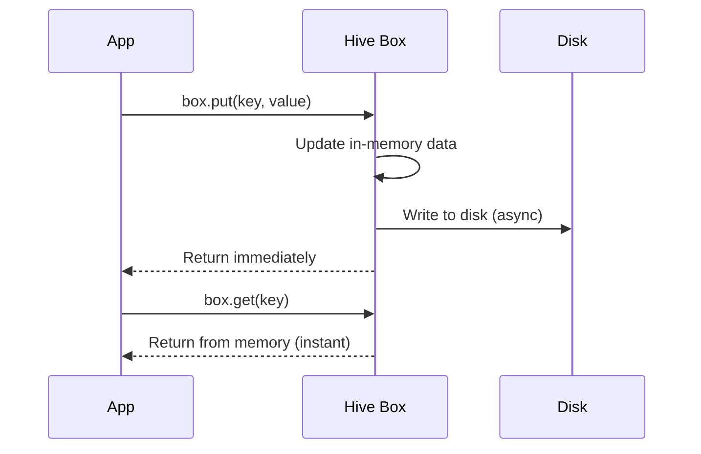

## Offline-First Philosophy

The Flutter Billing App is designed as an **offline-first** application, meaning it functions completely without internet connectivity. All data is stored locally using Hive, a fast and lightweight NoSQL database built for Flutter.

<CardGroup cols={2}>
  <Card title="Always Available" icon="check-circle">
    App works in any environment - no network required for core functionality
  </Card>
  <Card title="Lightning Fast" icon="bolt">
    Local database access is instantaneous compared to network requests
  </Card>
  <Card title="Simple Architecture" icon="cube">
    No sync complexity, no API layers, no network error handling
  </Card>
  <Card title="Privacy Focused" icon="shield">
    All data stays on device - perfect for sensitive business information
  </Card>
</CardGroup>

## Why Hive?

Hive is the ideal choice for this application:

<AccordionGroup>
  <Accordion title="Pure Dart - No Native Dependencies">
    Hive is written entirely in Dart, requiring no platform-specific setup. This means consistent behavior across Android, iOS, web, and desktop.
  </Accordion>
  <Accordion title="Type-Safe & Code Generated">
    Hive uses code generation to create type adapters, eliminating runtime serialization errors and improving performance.
  </Accordion>
  <Accordion title="Extremely Fast">
    Hive is optimized for mobile devices with lazy loading and efficient binary serialization. It's significantly faster than SQLite for many use cases.
  </Accordion>
  <Accordion title="Simple API">
    No complex queries or migrations - just key-value storage with type safety. Perfect for this app's straightforward data model.
  </Accordion>
</AccordionGroup>

## Database Initialization

Hive is initialized at application startup from `main.dart:15`:

```dart lib/main.dart
void main() async {
  WidgetsFlutterBinding.ensureInitialized();
  await HiveDatabase.init();  // Initialize Hive first
  await di.init();            // Then setup dependencies
  runApp(const MyApp());
}
```

### HiveDatabase Service

The `HiveDatabase` class centralizes all Hive configuration:

```dart lib/core/data/hive_database.dart
import 'package:hive_flutter/hive_flutter.dart';
import '../../features/product/data/models/product_model.dart';
import '../../features/shop/data/models/shop_model.dart';

class HiveDatabase {
  // Box names as constants
  static const String productBoxName = 'products';
  static const String shopBoxName = 'shop';
  static const String settingsBoxName = 'settings';

  static Future<void> init() async {
    // Initialize Hive for Flutter
    await Hive.initFlutter();

    // Register type adapters (generated by build_runner)
    Hive.registerAdapter(ProductModelAdapter());
    Hive.registerAdapter(ShopModelAdapter());

    // Open boxes - creates them if they don't exist
    await Hive.openBox<ProductModel>(productBoxName);
    await Hive.openBox<ShopModel>(shopBoxName);
    await Hive.openBox(settingsBoxName); // Generic box for key-value pairs
  }

  // Getters for type-safe box access
  static Box<ProductModel> get productBox =>
      Hive.box<ProductModel>(productBoxName);
  static Box<ShopModel> get shopBox => Hive.box<ShopModel>(shopBoxName);
  static Box get settingsBox => Hive.box(settingsBoxName);
}
```

<Steps>
  <Step title="Initialize Hive Flutter">
    `Hive.initFlutter()` sets up the default directory for storing database files
  </Step>
  <Step title="Register Type Adapters">
    Adapters tell Hive how to serialize/deserialize custom objects
  </Step>
  <Step title="Open Boxes">
    Boxes are like tables in SQL - each stores a collection of typed objects
  </Step>
  <Step title="Provide Static Accessors">
    Static getters give global access to boxes throughout the app
  </Step>
</Steps>

<Info>
**Box Types**: 
- `Box<ProductModel>` is type-safe - only accepts ProductModel objects
- `Box` (generic) accepts any type - used for simple key-value storage
</Info>

## Type Adapters

Hive requires type adapters to serialize custom classes. These are generated using `build_runner`:

### Defining Models for Hive

```dart lib/features/product/data/models/product_model.dart
import 'package:hive/hive.dart';
import '../../domain/entities/product.dart';

part 'product_model.g.dart'; // Generated file

@HiveType(typeId: 0)  // Unique ID for this type
class ProductModel extends Product {
  @override
  @HiveField(0)  // Field index for serialization
  final String id;
  
  @override
  @HiveField(1)
  final String name;
  
  @override
  @HiveField(2)
  final String barcode;
  
  @override
  @HiveField(3)
  final double price;
  
  @override
  @HiveField(4)
  final int stock;

  const ProductModel({
    required this.id,
    required this.name,
    required this.barcode,
    required this.price,
    required this.stock,
  }) : super(
          id: id,
          name: name,
          barcode: barcode,
          price: price,
          stock: stock,
        );

  factory ProductModel.fromEntity(Product product) {
    return ProductModel(
      id: product.id,
      name: product.name,
      barcode: product.barcode,
      price: product.price,
      stock: product.stock,
    );
  }
}
```

<Warning>
**Important**: Each `@HiveType` must have a unique `typeId` across your entire app. Field indices in `@HiveField` must be unique within a type and should never be changed after data is stored.
</Warning>

### Generating Adapters

Run the code generator to create adapter files:

```bash
dart run build_runner build --delete-conflicting-outputs
```

This creates `product_model.g.dart` containing `ProductModelAdapter`.

## Data Operations

All CRUD operations are handled in repository implementations:

### Create (Add)

```dart lib/features/product/data/repositories/product_repository_impl.dart
@override
Future<Either<Failure, void>> addProduct(Product product) async {
  try {
    final box = HiveDatabase.productBox;
    final model = ProductModel.fromEntity(product);
    await box.put(model.id, model); // Key-value storage
    return const Right(null);
  } catch (e) {
    return Left(CacheFailure(e.toString()));
  }
}
```

<Info>
**Key-Value Pattern**: `box.put(key, value)` stores an object with a specific key. Using the product ID as the key allows direct lookups and prevents duplicates.
</Info>

### Read (Get All)

```dart
@override
Future<Either<Failure, List<Product>>> getProducts() async {
  try {
    final box = HiveDatabase.productBox;
    final products = box.values.toList(); // Get all values
    return Right(products);
  } catch (e) {
    return Left(CacheFailure(e.toString()));
  }
}
```

### Read (Get by Query)

```dart
@override
Future<Either<Failure, Product>> getProductByBarcode(String barcode) async {
  try {
    final box = HiveDatabase.productBox;
    final product = box.values.firstWhere(
      (element) => element.barcode == barcode,
      orElse: () => throw Exception('Product not found'),
    );
    return Right(product);
  } catch (e) {
    return Left(CacheFailure(e.toString()));
  }
}
```

<Note>
Hive doesn't have built-in queries. For simple searches, iterate over `box.values`. For complex queries, consider indexing strategies or using Hive's lazy box feature.
</Note>

### Update

```dart
@override
Future<Either<Failure, void>> updateProduct(Product product) async {
  try {
    final box = HiveDatabase.productBox;
    final model = ProductModel.fromEntity(product);
    await box.put(model.id, model); // Overwrites existing key
    return const Right(null);
  } catch (e) {
    return Left(CacheFailure(e.toString()));
  }
}
```

<Info>
**Update = Put**: In key-value stores, update is the same as create - just overwrite the existing key with new data.
</Info>

### Delete

```dart
@override
Future<Either<Failure, void>> deleteProduct(String id) async {
  try {
    final box = HiveDatabase.productBox;
    await box.delete(id); // Remove by key
    return const Right(null);
  } catch (e) {
    return Left(CacheFailure(e.toString()));
  }
}
```

## Settings Storage

The generic settings box stores simple key-value pairs:

```dart
// Save printer MAC address
HiveDatabase.settingsBox.put('printer_mac', '00:11:22:33:44:55');

// Retrieve printer MAC address
final savedMac = HiveDatabase.settingsBox.get('printer_mac');

if (savedMac != null) {
  // Auto-connect to saved printer
  await printerHelper.connect(savedMac);
}
```

This pattern is used in the Billing BLoC at `lib/features/billing/presentation/bloc/billing_bloc.dart:90`:

```dart
if (!printerHelper.isConnected) {
  final savedMac = HiveDatabase.settingsBox.get('printer_mac');
  if (savedMac != null) {
    final connected = await printerHelper.connect(savedMac);
    if (!connected) {
      emit(state.copyWith(error: 'Failed to auto-connect to printer!'));
      return;
    }
  }
}
```

## Data Persistence Lifecycle

Hive automatically persists data to disk:



<Check>
**Performance**: Hive keeps data in memory for fast reads and writes asynchronously to disk in the background. This gives you both speed and persistence.
</Check>

## Advantages of Offline-First

### For Users

<CardGroup cols={2}>
  <Card title="Works Everywhere" icon="location-dot">
    Exhibitions, markets, remote locations - no WiFi needed
  </Card>
  <Card title="Instant Response" icon="gauge-high">
    Zero network latency - all operations are immediate
  </Card>
  <Card title="Privacy" icon="lock">
    Data never leaves the device - complete confidentiality
  </Card>
  <Card title="Reliability" icon="shield-check">
    No server downtime, no connectivity issues to worry about
  </Card>
</CardGroup>

### For Developers

<CardGroup cols={2}>
  <Card title="Simple Architecture" icon="diagram-project">
    No API layer, no network error handling, no retry logic
  </Card>
  <Card title="Faster Development" icon="rocket">
    Focus on features, not infrastructure
  </Card>
  <Card title="Easy Testing" icon="flask">
    No mocking network calls - just test with real Hive
  </Card>
  <Card title="Lower Costs" icon="dollar-sign">
    No backend servers, no database hosting, no API fees
  </Card>
</CardGroup>

## Limitations & Tradeoffs

<Warning>
**Single Device**: Data is stored locally and not synchronized across devices. For multi-device support, you'd need to add a sync layer.
</Warning>

<Warning>
**No Backup**: Data is only on the device. Users should be educated about device backup strategies or implement export functionality.
</Warning>

<Warning>
**No Collaboration**: Multiple users can't work on the same data simultaneously. Perfect for single-cashier setups.
</Warning>

## Future: Adding Sync

If you need to add cloud sync later, the architecture supports it:

<Steps>
  <Step title="Add RemoteDataSource">
    Create API layer in data layer
  </Step>
  <Step title="Update Repository">
    Check remote first, fall back to local cache
  </Step>
  <Step title="Implement Sync Logic">
    Use background workers to sync when online
  </Step>
  <Step title="Handle Conflicts">
    Last-write-wins or custom merge strategies
  </Step>
</Steps>

The Clean Architecture makes this easy - domain layer stays unchanged, only data layer is modified.

## Best Practices

<Steps>
  <Step title="Use descriptive box names">
    Constants like `productBoxName` prevent typos and enable refactoring
  </Step>
  <Step title="Never change typeId or field indices">
    Once data is stored, these must remain stable or you'll lose data
  </Step>
  <Step title="Use meaningful keys">
    Product IDs as keys enable direct lookups: `box.get(productId)`
  </Step>
  <Step title="Wrap operations in try-catch">
    Always handle potential Hive errors and return `Either<Failure, T>`
  </Step>
  <Step title="Close boxes on app shutdown">
    Call `Hive.close()` in app disposal for clean shutdowns
  </Step>
  <Step title="Consider lazy boxes for large datasets">
    LazyBox only loads values when accessed, saving memory
  </Step>
</Steps>

## Hive vs Alternatives

| Feature | Hive | SQLite | SharedPreferences |
|---------|------|--------|-------------------|
| **Type Safety** | ✅ Yes | ❌ No (dynamic) | ❌ No (primitives only) |
| **Performance** | 🚀 Very Fast | ⚡ Fast | 🚀 Very Fast |
| **Complex Queries** | ❌ Limited | ✅ Yes (SQL) | ❌ No |
| **Code Generation** | ✅ Yes | ❌ No | ❌ No |
| **Easy to Use** | ✅ Very Easy | ⚠️ Moderate | ✅ Easy |
| **Storage Limit** | 💾 Large | 💾 Large | 📦 Small |
| **Best For** | Objects & Collections | Relational Data | Simple Settings |

<Info>
**Project Fit**: Hive is perfect for this app because:
- Simple data model (products, shop, cart)
- No complex relationships or joins needed
- Fast reads/writes are critical for POS
- Type safety prevents runtime errors
</Info>

## Code Generation Reference

<CodeGroup>
```yaml pubspec.yaml
dev_dependencies:
  build_runner: ^2.4.0
  hive_generator: ^2.0.0
```

```bash Terminal
# Generate type adapters
dart run build_runner build --delete-conflicting-outputs

# Watch mode for development
dart run build_runner watch
```
</CodeGroup>

## Next Steps

<CardGroup cols={2}>
  <Card title="Product Management" icon="boxes-stacked" href="/features/product-management">
    Explore how features use the offline-first architecture
  </Card>
  <Card title="Installation" icon="download" href="/installation">
    Set up the project and run code generation
  </Card>
</CardGroup>