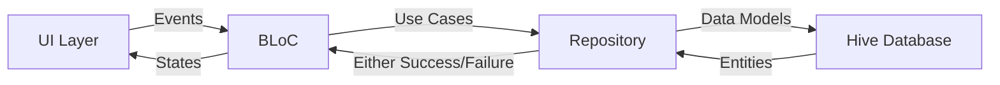

## Introduction

The Flutter Billing App is built using **Feature-First Clean Architecture** principles, combining industry-standard architectural patterns with feature-driven design. This architecture ensures scalability, maintainability, separation of concerns, and robust testability.

## Core Architectural Principles

<CardGroup cols={2}>
  <Card title="Clean Architecture" icon="layer-group">
    Clear separation between domain, data, and presentation layers with strict dependency rules
  </Card>
  <Card title="Feature-First" icon="folder-tree">
    Code organized by business features rather than technical layers
  </Card>
  <Card title="Offline-First" icon="database">
    Local-first data architecture using Hive for instant access without network dependency
  </Card>
  <Card title="Dependency Injection" icon="plug">
    Centralized dependency management using GetIt for loose coupling
  </Card>
</CardGroup>

## Technology Stack

The application leverages proven Flutter packages and patterns:

| Category | Technology | Purpose |
|----------|-----------|----------|
| **Framework** | Flutter SDK >=3.1.0 | Cross-platform mobile development |
| **State Management** | flutter_bloc | Predictable state management using BLoC pattern |
| **Dependency Injection** | get_it | Service locator for dependency management |
| **Routing** | go_router | Declarative routing with deep linking support |
| **Local Database** | hive & hive_flutter | Lightning-fast NoSQL local storage |
| **Data Modeling** | json_serializable, equatable | Code generation and value equality |
| **Functional Programming** | fpdart | Either monad for error handling |
| **Hardware Integration** | mobile_scanner, print_bluetooth_thermal | Barcode scanning and thermal printing |

## Project Structure

The codebase follows a **feature-first** organization where each feature is self-contained with its own layers:

```text
lib/
├── core/                       # Shared application infrastructure
│   ├── data/                   # Global data sources (Hive initialization)
│   ├── error/                  # Standardized Failure/Exception models
│   ├── theme/                  # UI theme, typography, styling
│   ├── usecase/                # Base UseCase contracts
│   ├── utils/                  # Helpers (PrinterHelper, validators)
│   ├── widgets/                # Reusable global UI components
│   └── service_locator.dart    # Dependency injection setup
│
├── config/                     # Application configuration
│   └── routes/                 # Routing configuration
│
└── features/                   # Feature modules
    ├── billing/                # POS operations: Cart, Checkout, Receipts
    │   ├── domain/             # Business entities and logic
    │   └── presentation/       # UI and BLoC state management
    │
    ├── product/                # Inventory management
    │   ├── data/               # Data models and repositories
    │   ├── domain/             # Entities, repositories, use cases
    │   └── presentation/       # UI and BLoC state management
    │
    ├── settings/               # Printer & app settings
    │   ├── data/               # Repository implementations
    │   ├── domain/             # Repository contracts
    │   └── presentation/       # Settings UI and BLoC
    │
    └── shop/                   # Shop details configuration
        ├── data/               # Shop data models and repositories
        ├── domain/             # Shop entities and use cases
        └── presentation/       # Shop configuration UI
```

## Feature Modules

Each feature module is organized into Clean Architecture layers:

### Product Feature

**Purpose**: Complete inventory management with CRUD operations, barcode scanning, and product catalog.

<CodeGroup>
```dart lib/features/product/domain/entities/product.dart
import 'package:equatable/equatable.dart';

class Product extends Equatable {
  final String id;
  final String name;
  final String barcode;
  final double price;
  final int stock;

  const Product({
    required this.id,
    required this.name,
    required this.barcode,
    required this.price,
    this.stock = 0,
  });

  @override
  List<Object?> get props => [id, name, barcode, price, stock];
}
```
</CodeGroup>

### Billing Feature

**Purpose**: Core POS operations including cart management, checkout flow, and receipt generation.

<CodeGroup>
```dart lib/features/billing/domain/entities/cart_item.dart
import 'package:equatable/equatable.dart';
import 'package:billing_app/features/product/domain/entities/product.dart';

class CartItem extends Equatable {
  final Product product;
  final int quantity;

  const CartItem({
    required this.product,
    this.quantity = 1,
  });

  double get total => product.price * quantity;

  @override
  List<Object> get props => [product, quantity];
}
```
</CodeGroup>

### Shop Feature

**Purpose**: Manage shop details (name, address, phone) that appear on printed receipts.

### Settings Feature

**Purpose**: Configure Bluetooth thermal printer connections and application settings.

## Application Bootstrap

The application initializes with a clear sequence from `main.dart:13`:

```dart lib/main.dart
void main() async {
  WidgetsFlutterBinding.ensureInitialized();
  await HiveDatabase.init();        // Initialize local database
  await di.init();                  // Setup dependency injection
  runApp(const MyApp());
}
```

<Steps>
  <Step title="Database Initialization">
    Hive database is initialized with registered adapters for ProductModel and ShopModel
  </Step>
  <Step title="Dependency Registration">
    GetIt service locator registers all repositories, use cases, and BLoCs
  </Step>
  <Step title="BLoC Providers">
    MultiBlocProvider makes state management available throughout the widget tree
  </Step>
  <Step title="Router Configuration">
    GoRouter handles declarative navigation and deep linking
  </Step>
</Steps>

## Data Flow Architecture

The application follows a unidirectional data flow:



<Info>
**Key Insight**: All data operations return `Either<Failure, Result>` from the `fpdart` package, enabling functional error handling without exceptions.
</Info>

## Dependency Flow

Dependencies flow from outer layers (UI) to inner layers (domain):

<Steps>
  <Step title="Presentation Layer">
    Depends on domain layer only - never imports from data layer
  </Step>
  <Step title="Domain Layer">
    Independent of all other layers - contains pure business logic
  </Step>
  <Step title="Data Layer">
    Depends on domain layer - implements repository contracts
  </Step>
</Steps>

## Next Steps

<CardGroup cols={2}>
  <Card title="Clean Architecture" icon="sitemap" href="/architecture/clean-architecture">
    Deep dive into domain, data, and presentation layers
  </Card>
  <Card title="State Management" icon="arrows-spin" href="/architecture/state-management">
    Learn the BLoC pattern implementation
  </Card>
  <Card title="Offline-First" icon="wifi-slash" href="/architecture/offline-first">
    Understand local-first data persistence
  </Card>
  <Card title="Features" icon="puzzle-piece" href="/features/product-management">
    Explore individual feature implementations
  </Card>
</CardGroup>