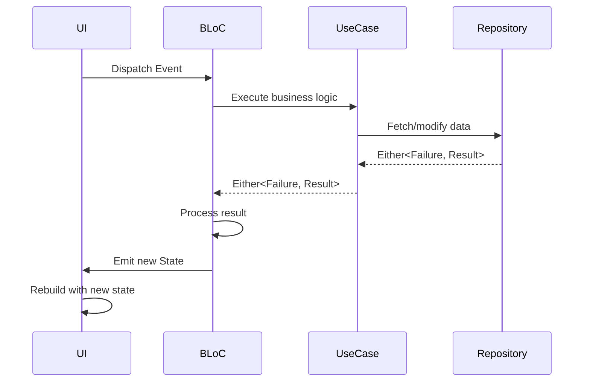

## BLoC Pattern Overview

The Flutter Billing App uses the **BLoC (Business Logic Component)** pattern for state management via the `flutter_bloc` package. BLoC provides predictable state management with clear separation between business logic and UI.

<Frame>
  
</Frame>

## Core Concepts

<CardGroup cols={3}>
  <Card title="Events" icon="bolt" color="#3B82F6">
    User actions or system triggers sent to BLoC
  </Card>
  <Card title="BLoC" icon="microchip" color="#8B5CF6">
    Processes events and emits new states
  </Card>
  <Card title="States" icon="layer-group" color="#10B981">
    Immutable snapshots of UI data
  </Card>
</CardGroup>

## Unidirectional Data Flow

BLoC enforces a unidirectional data flow:



## BLoC Structure

Each feature has a BLoC composed of three files:

<Tabs>
  <Tab title="Events">
    Define all possible user actions
  </Tab>
  <Tab title="States">
    Define all possible UI states
  </Tab>
  <Tab title="BLoC">
    Maps events to states using business logic
  </Tab>
</Tabs>

## Product Feature Example

Let's examine the Product feature's BLoC implementation:

### Events

Events represent user intentions or system triggers:

```dart lib/features/product/presentation/bloc/product_event.dart
import 'package:equatable/equatable.dart';
import '../../domain/entities/product.dart';

abstract class ProductEvent extends Equatable {
  const ProductEvent();

  @override
  List<Object> get props => [];
}

// Load all products from database
class LoadProducts extends ProductEvent {}

// Add a new product
class AddProduct extends ProductEvent {
  final Product product;
  const AddProduct(this.product);
  
  @override
  List<Object> get props => [product];
}

// Update existing product
class UpdateProduct extends ProductEvent {
  final Product product;
  const UpdateProduct(this.product);
  
  @override
  List<Object> get props => [product];
}

// Delete a product by ID
class DeleteProduct extends ProductEvent {
  final String id;
  const DeleteProduct(this.id);
  
  @override
  List<Object> get props => [id];
}
```

<Info>
Events extend `Equatable` to enable equality comparison. The `props` getter defines which properties are used for equality checks - critical for BLoC's internal optimization.
</Info>

### States

States represent different UI configurations:

```dart lib/features/product/presentation/bloc/product_state.dart
import 'package:equatable/equatable.dart';
import '../../domain/entities/product.dart';

enum ProductStatus { initial, loading, loaded, error, success }

class ProductState extends Equatable {
  final ProductStatus status;
  final List<Product> products;
  final String? message;

  const ProductState({
    this.status = ProductStatus.initial,
    this.products = const [],
    this.message,
  });

  // Create a copy with modified fields
  ProductState copyWith({
    ProductStatus? status,
    List<Product>? products,
    String? message,
  }) {
    return ProductState(
      status: status ?? this.status,
      products: products ?? this.products,
      message: message,
    );
  }

  @override
  List<Object?> get props => [status, products, message];
}
```

<AccordionGroup>
  <Accordion title="Why use enums for status?">
    Enums provide type-safe status management. The UI can easily switch on status values without string comparisons or boolean flags.
  </Accordion>
  <Accordion title="Why copyWith pattern?">
    States are immutable. `copyWith` creates a new state instance with some fields updated, preserving immutability while allowing state transitions.
  </Accordion>
</AccordionGroup>

### BLoC Implementation

The BLoC maps events to states:

```dart lib/features/product/presentation/bloc/product_bloc.dart
import 'package:bloc/bloc.dart';
import 'package:equatable/equatable.dart';
import '../../domain/entities/product.dart';
import '../../domain/usecases/product_usecases.dart';
import '../../../../core/usecase/usecase.dart';

part 'product_event.dart';
part 'product_state.dart';

class ProductBloc extends Bloc<ProductEvent, ProductState> {
  final GetProductsUseCase getProductsUseCase;
  final AddProductUseCase addProductUseCase;
  final UpdateProductUseCase updateProductUseCase;
  final DeleteProductUseCase deleteProductUseCase;

  ProductBloc({
    required this.getProductsUseCase,
    required this.addProductUseCase,
    required this.updateProductUseCase,
    required this.deleteProductUseCase,
  }) : super(const ProductState()) {
    // Register event handlers
    on<LoadProducts>(_onLoadProducts);
    on<AddProduct>(_onAddProduct);
    on<UpdateProduct>(_onUpdateProduct);
    on<DeleteProduct>(_onDeleteProduct);
  }

  Future<void> _onLoadProducts(
      LoadProducts event, Emitter<ProductState> emit) async {
    emit(state.copyWith(status: ProductStatus.loading));
    
    final result = await getProductsUseCase(NoParams());
    
    result.fold(
      (failure) => emit(state.copyWith(
          status: ProductStatus.error, 
          message: failure.message)),
      (products) => emit(state.copyWith(
          status: ProductStatus.loaded, 
          products: products)),
    );
  }

  Future<void> _onAddProduct(
      AddProduct event, Emitter<ProductState> emit) async {
    emit(state.copyWith(status: ProductStatus.loading));
    
    final result = await addProductUseCase(event.product);
    
    result.fold(
      (failure) => emit(state.copyWith(
          status: ProductStatus.error, 
          message: failure.message)),
      (_) {
        emit(state.copyWith(
            status: ProductStatus.success,
            message: 'Product added successfully'));
        // Reload products after successful add
        add(LoadProducts());
      },
    );
  }

  Future<void> _onUpdateProduct(
      UpdateProduct event, Emitter<ProductState> emit) async {
    emit(state.copyWith(status: ProductStatus.loading));
    
    final result = await updateProductUseCase(event.product);
    
    result.fold(
      (failure) => emit(state.copyWith(
          status: ProductStatus.error, 
          message: failure.message)),
      (_) {
        emit(state.copyWith(
            status: ProductStatus.success,
            message: 'Product updated successfully'));
        add(LoadProducts());
      },
    );
  }

  Future<void> _onDeleteProduct(
      DeleteProduct event, Emitter<ProductState> emit) async {
    emit(state.copyWith(status: ProductStatus.loading));
    
    final result = await deleteProductUseCase(event.id);
    
    result.fold(
      (failure) => emit(state.copyWith(
          status: ProductStatus.error, 
          message: failure.message)),
      (_) {
        emit(state.copyWith(
            status: ProductStatus.success,
            message: 'Product deleted successfully'));
        add(LoadProducts());
      },
    );
  }
}
```

<Check>
**Pattern**: Each event handler follows the same flow:
1. Emit loading state
2. Call use case
3. Fold over Either result
4. Emit success or error state
</Check>

## Billing Feature Example

The Billing BLoC manages cart operations with more complex state:

### Events

```dart lib/features/billing/presentation/bloc/billing_event.dart
abstract class BillingEvent extends Equatable {
  const BillingEvent();
  @override
  List<Object> get props => [];
}

class ScanBarcodeEvent extends BillingEvent {
  final String barcode;
  const ScanBarcodeEvent(this.barcode);
  @override
  List<Object> get props => [barcode];
}

class AddProductToCartEvent extends BillingEvent {
  final Product product;
  const AddProductToCartEvent(this.product);
  @override
  List<Object> get props => [product];
}

class RemoveProductFromCartEvent extends BillingEvent {
  final String productId;
  const RemoveProductFromCartEvent(this.productId);
  @override
  List<Object> get props => [productId];
}

class UpdateQuantityEvent extends BillingEvent {
  final String productId;
  final int quantity;
  const UpdateQuantityEvent(this.productId, this.quantity);
  @override
  List<Object> get props => [productId, quantity];
}

class ClearCartEvent extends BillingEvent {}

class PrintReceiptEvent extends BillingEvent {
  final String shopName;
  final String address1;
  final String address2;
  final String phone;
  final String footer;

  const PrintReceiptEvent({
    required this.shopName,
    required this.address1,
    required this.address2,
    required this.phone,
    required this.footer,
  });

  @override
  List<Object> get props => [shopName, address1, address2, phone, footer];
}
```

### States with Computed Properties

```dart lib/features/billing/presentation/bloc/billing_state.dart
import 'package:equatable/equatable.dart';
import '../../domain/entities/cart_item.dart';

class BillingState extends Equatable {
  final List<CartItem> cartItems;
  final String? error;
  final bool isPrinting;
  final bool printSuccess;

  const BillingState({
    this.cartItems = const [],
    this.error,
    this.isPrinting = false,
    this.printSuccess = false,
  });

  // Computed property - calculated from cart items
  double get totalAmount => cartItems.fold(0, (sum, item) => sum + item.total);

  BillingState copyWith({
    List<CartItem>? cartItems,
    String? error,
    bool clearError = false,
    bool? isPrinting,
    bool? printSuccess,
  }) {
    return BillingState(
      cartItems: cartItems ?? this.cartItems,
      error: clearError ? null : (error ?? this.error),
      isPrinting: isPrinting ?? this.isPrinting,
      printSuccess: printSuccess ?? this.printSuccess,
    );
  }

  @override
  List<Object?> get props => [cartItems, error, isPrinting, printSuccess];
}
```

<Info>
**Computed Properties**: The `totalAmount` getter is calculated on-demand from cart items. This keeps state minimal and prevents synchronization issues.
</Info>

### Complex Event Handling

The billing BLoC demonstrates advanced patterns:

```dart lib/features/billing/presentation/bloc/billing_bloc.dart
Future<void> _onScanBarcode(
    ScanBarcodeEvent event, Emitter<BillingState> emit) async {
  final result = await getProductByBarcodeUseCase(event.barcode);
  
  result.fold(
    (failure) => emit(state.copyWith(
        error: 'Product not found: ${event.barcode}')),
    (product) {
      // Chain events: scanning triggers adding to cart
      add(AddProductToCartEvent(product));
    },
  );
}

void _onAddProductToCart(
    AddProductToCartEvent event, Emitter<BillingState> emit) {
  // Clear previous errors
  final cleanState = state.copyWith(error: null);

  // Check if product already in cart
  final existingIndex = cleanState.cartItems
      .indexWhere((item) => item.product.id == event.product.id);
      
  if (existingIndex >= 0) {
    // Increment quantity of existing item
    final existingItem = cleanState.cartItems[existingIndex];
    final updatedItems = List<CartItem>.from(cleanState.cartItems);
    updatedItems[existingIndex] =
        existingItem.copyWith(quantity: existingItem.quantity + 1);
    emit(cleanState.copyWith(cartItems: updatedItems, error: null));
  } else {
    // Add new item to cart
    final newItem = CartItem(product: event.product);
    emit(cleanState.copyWith(
        cartItems: [...cleanState.cartItems, newItem], error: null));
  }
}

void _onUpdateQuantity(
    UpdateQuantityEvent event, Emitter<BillingState> emit) {
  if (event.quantity <= 0) {
    // Auto-remove if quantity becomes zero
    add(RemoveProductFromCartEvent(event.productId));
    return;
  }

  final index = state.cartItems
      .indexWhere((item) => item.product.id == event.productId);
      
  if (index >= 0) {
    final items = List<CartItem>.from(state.cartItems);
    items[index] = items[index].copyWith(quantity: event.quantity);
    emit(state.copyWith(cartItems: items));
  }
}
```

<AccordionGroup>
  <Accordion title="Why chain events?">
    `ScanBarcodeEvent` adds another event (`AddProductToCartEvent`) after finding the product. This keeps event handlers focused and allows reusing the add logic from multiple sources.
  </Accordion>
  <Accordion title="Why create new lists?">
    `List<CartItem>.from(state.cartItems)` creates a new list instance. This is required because states must be immutable - modifying the existing list would violate immutability.
  </Accordion>
</AccordionGroup>

## UI Integration

BLoCs are provided to the widget tree via `BlocProvider`:

```dart lib/main.dart
class MyApp extends StatelessWidget {
  @override
  Widget build(BuildContext context) {
    return MultiBlocProvider(
      providers: [
        BlocProvider<ProductBloc>(
            create: (context) => di.sl<ProductBloc>()..add(LoadProducts())),
        BlocProvider<ShopBloc>(
            create: (context) => di.sl<ShopBloc>()..add(LoadShopEvent())),
        BlocProvider<BillingBloc>(
            create: (context) =>
                BillingBloc(getProductByBarcodeUseCase: di.sl())),
        BlocProvider<PrinterBloc>(
            create: (context) => di.sl<PrinterBloc>()..add(InitPrinterEvent())),
      ],
      child: MaterialApp.router(
        title: 'Billing App',
        theme: AppTheme.lightTheme,
        routerConfig: router,
      ),
    );
  }
}
```

### Dispatching Events

```dart
// Get BLoC from context and add event
context.read<ProductBloc>().add(AddProduct(newProduct));
```

### Consuming States

```dart
BlocBuilder<ProductBloc, ProductState>(
  builder: (context, state) {
    if (state.status == ProductStatus.loading) {
      return CircularProgressIndicator();
    }
    
    if (state.status == ProductStatus.error) {
      return Text('Error: ${state.message}');
    }
    
    if (state.status == ProductStatus.loaded) {
      return ListView.builder(
        itemCount: state.products.length,
        itemBuilder: (context, index) {
          return ProductTile(product: state.products[index]);
        },
      );
    }
    
    return SizedBox.shrink();
  },
)
```

### Listening to State Changes

```dart
BlocListener<ProductBloc, ProductState>(
  listener: (context, state) {
    if (state.status == ProductStatus.success) {
      ScaffoldMessenger.of(context).showSnackBar(
        SnackBar(content: Text(state.message ?? 'Success')),
      );
    }
  },
  child: YourWidget(),
)
```

## Best Practices

<Steps>
  <Step title="Keep BLoC logic-only">
    BLoCs should never import Flutter widgets. Only business logic and domain imports.
  </Step>
  <Step title="Use Equatable everywhere">
    All events and states must extend Equatable for proper comparison.
  </Step>
  <Step title="Make states immutable">
    Use `copyWith` to create new states. Never mutate existing state objects.
  </Step>
  <Step title="Single responsibility per event">
    Each event should represent one clear user intention or system trigger.
  </Step>
  <Step title="Handle all states in UI">
    Check for loading, error, and success states. Provide feedback for each.
  </Step>
  <Step title="Use computed properties">
    Derive data from state fields rather than storing redundant data.
  </Step>
</Steps>

## Common Patterns

<CardGroup cols={2}>
  <Card title="Event Chaining" icon="link">
    One event can dispatch another event after processing (e.g., scan → add to cart)
  </Card>
  <Card title="Optimistic Updates" icon="rocket">
    Update UI immediately, revert on failure
  </Card>
  <Card title="Loading States" icon="spinner">
    Always emit loading state before async operations
  </Card>
  <Card title="Error Clearing" icon="eraser">
    Clear errors when new events are dispatched
  </Card>
</CardGroup>

## Testing BLoCs

BLoCs are highly testable since they're pure Dart classes:

```dart
test('emits loaded state when products are fetched successfully', () async {
  // Arrange
  when(mockGetProductsUseCase(any))
      .thenAnswer((_) async => Right([mockProduct]));
  
  // Act & Assert
  blocTest<ProductBloc, ProductState>(
    'emits [loading, loaded] when LoadProducts is added',
    build: () => ProductBloc(
      getProductsUseCase: mockGetProductsUseCase,
      addProductUseCase: mockAddProductUseCase,
      updateProductUseCase: mockUpdateProductUseCase,
      deleteProductUseCase: mockDeleteProductUseCase,
    ),
    act: (bloc) => bloc.add(LoadProducts()),
    expect: () => [
      ProductState(status: ProductStatus.loading),
      ProductState(status: ProductStatus.loaded, products: [mockProduct]),
    ],
  );
});
```

## Next Steps

<CardGroup cols={2}>
  <Card title="Offline-First Architecture" icon="database" href="/architecture/offline-first">
    Learn how Hive provides local-first data persistence
  </Card>
  <Card title="Billing & Checkout" icon="shopping-cart" href="/features/billing-checkout">
    Explore complete feature implementations
  </Card>
</CardGroup>